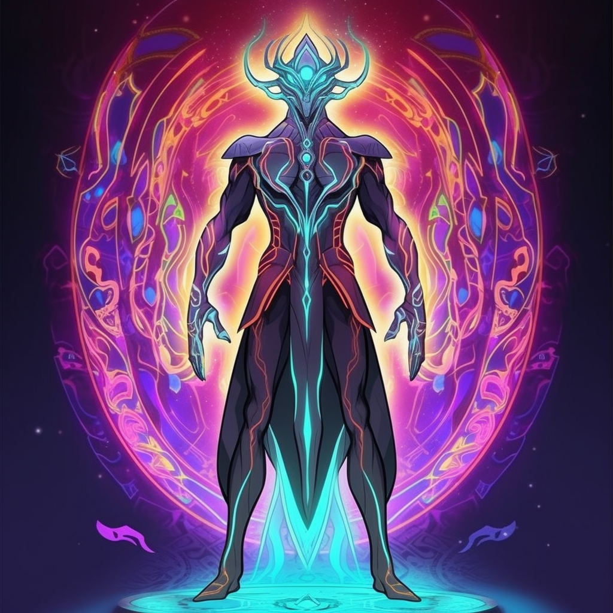

# Zyxal'thur

Zyx'althur, the alien overlord, has a visage that defies earthly comprehension. Here is a description of his appearance:

Zyx'althur stands tall, towering over mere mortals with an imposing height of ten feet. His physique is slender, yet radiates an aura of immense power. His alien anatomy is comprised of iridescent, luminescent skin that shimmers with hues unseen in the earthly spectrum. Waves of energy ripple across his form, giving the impression of a living cosmos contained within his very being.

His head is adorned with a crown-like structure, adorned with intricate, glowing runes that hover in a halo around him. Glowing tendrils of energy extend from his head, resembling ethereal antennae that serve as conduits for his cosmic abilities. His eyes, two radiant orbs of cosmic energy, flicker with an otherworldly light, containing galaxies swirling within their depths.

Zyx'althur's limbs are elongated and agile, with an otherworldly grace. His fingers and toes end in delicate, yet razor-sharp, claws, hinting at his potential for destruction. He is draped in regal, flowing garments, woven from materials unknown on Earth, with patterns that shift and change as if alive.

From his back, a pair of majestic, ethereal wings extend, pulsating with energy. These wings are not used for flight in the conventional sense but rather serve as conduits for his cosmic powers, enabling Zyx'althur to manipulate energy and traverse the realms beyond.

His mere presence commands attention and instills both awe and fear in those who behold him. Zyx'althur, the embodiment of cosmic might, is an alien being whose appearance transcends the boundaries of the known universe.
